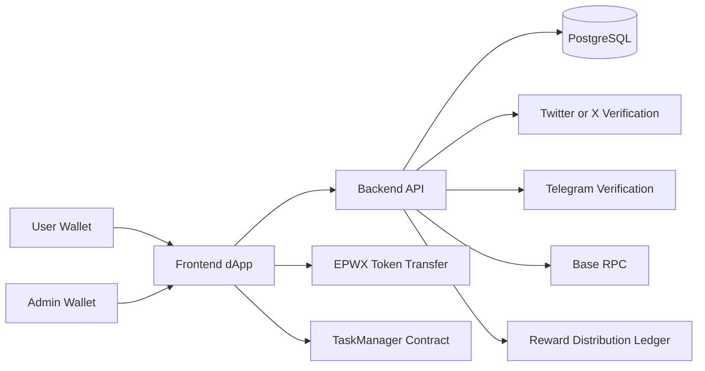

# EPWX Utility White Paper

Version 1.0  
Date: 2026-05-30

## Disclaimer

This document describes the EPWX utility model and the current implementation of the EPWX Task Hub as reflected in this repository. It is a product and utility paper, not an investment prospectus, offer of securities, or financial advice. Some sections describe current live mechanics, while others describe the intended direction of the platform based on components already present in the codebase.

## Abstract

EPWX is a utility token powering a reward and participation layer on Base. The EPWX Task Hub combines social engagement campaigns, community verification, merchant-linked reward claims, cashback incentives, and transparent distribution records into a single platform. The objective is to convert community attention, verified participation, and ecosystem activity into measurable on-chain and application-level utility for EPWX.

In its current form, the platform uses a hybrid architecture. Wallet signatures, eligibility checks, campaign logic, and anti-abuse controls are enforced through the application stack, while token transfers are executed on Base and distribution records are persisted for auditability. A dedicated TaskManager smart contract also exists to support escrowed campaign rewards and verifier-driven task approvals.

## Vision

The EPWX network is designed around a simple principle: token utility should emerge from recurring user actions rather than passive branding alone. EPWX is therefore positioned as a working incentive asset for:

- daily user retention
- social growth campaigns
- merchant reward distribution
- purchase-linked cashback
- ecosystem participation tracking
- transparent reporting for supply and distribution

The long-term aim is to make EPWX useful across community growth, commerce, and reward infrastructure while keeping participation verifiable and distribution traceable.

## Problem Statement

Most token ecosystems struggle with three structural problems:

1. Rewards are easy to promise but hard to verify.
2. Marketing activity often generates low-quality or fraudulent engagement.
3. Community incentives are frequently detached from transparent distribution and measurable utility.

EPWX Task Hub addresses these problems by tying rewards to wallet-linked identity checks, social account verification, Telegram community gating, anti-duplication rules, and auditable reward records.

## Solution Overview

EPWX Task Hub is a Base-based reward platform that supports multiple utility layers:

- daily reward claims based on wallet ownership and wallet balance tiers
- special claims gated by admin eligibility and Telegram verification
- Twitter retweet campaigns with campaign-level reward settings
- merchant-linked claims reviewed and distributed by admins
- cashback rewards tied to qualifying EPWX purchase transactions
- public token supply endpoints for transparency and third-party integrations

The system combines off-chain verification, database-backed claim state, admin controls, and on-chain token transfers to create a practical reward engine for EPWX.

## EPWX Utility Model

EPWX utility is not defined by a single feature. It is a stack of recurring use cases that reinforce one another.

### 1. Daily Engagement Utility

Users can submit one daily claim per 24-hour period, subject to wallet-signature verification and IP-based rate controls. The current implementation applies a tiered reward model based on the wallet's EPWX holdings:

- Base daily reward: 100,000 EPWX
- Mid-tier daily reward: 2,000,000 EPWX
- Bonus daily reward: 5,000,000 EPWX
- Mega-tier daily reward: 10,000,000 EPWX

This creates a retention loop while also rewarding wallets with deeper EPWX alignment.

### 2. Social Campaign Utility

EPWX can be earned through campaign participation. The repository currently supports Twitter/X-linked flows including campaign management, screenshot-based retweet claims, and OAuth-backed Twitter identity verification for task integrity.

The current Twitter retweet campaign default reward is 100,000 EPWX per approved claim.

### 3. Community Membership Utility

Telegram verification is used as a community membership gate for selected reward flows, especially daily and special claims. This converts token rewards into a mechanism for strengthening and measuring community participation.

### 4. Merchant Reward Utility

The merchant flow allows EPWX to act as a promotional reward distributed to customers of participating merchants. Claims are tied to physical presence and merchant context rather than being abstract wallet-only rewards. This expands EPWX utility beyond purely online campaigns.

### 5. Cashback Utility

The cashback layer connects EPWX activity to qualifying purchases. In the current implementation, eligible users can submit a cashback claim tied to a verified EPWX purchase transaction that meets the configured threshold.

Current cashback parameters in the repository:

- qualifying purchase threshold: 100,000,000,000 EPWX
- fixed cashback reward: 1,000,000,000 EPWX
- qualifying transaction window: last 3 hours

### 6. Campaign Escrow Utility

The TaskManager contract supports advertiser-funded campaigns where EPWX is escrowed into a smart contract and later allocated to verified participants. This gives EPWX a direct role in campaign creation, budget locking, task verification, and claims.

## Product Architecture

EPWX Task Hub uses a hybrid architecture composed of frontend, backend, database, verification services, and smart contracts.

### Frontend

The frontend is built with Next.js, TypeScript, Tailwind CSS, ConnectKit, and Wagmi. It provides:

- wallet connection
- campaign browsing
- claim submission interfaces
- admin reward distribution screens
- Telegram and Twitter integration surfaces
- user-facing statistics and claim history

### Backend

The backend is built with Node.js, Express, Sequelize, PostgreSQL, Passport, and Ethers. It is responsible for:

- claim eligibility checks
- Twitter and Telegram verification state
- admin authorization checks
- reward ledger persistence
- cashback transaction discovery
- public supply data endpoints

### Smart Contracts

The repository includes a TaskManager contract on Base for advertiser-funded task campaigns. It supports:

- campaign creation with escrowed EPWX
- verifier-controlled completion submission
- approval or rejection of task completions
- accumulation of pending rewards
- reward claiming by users
- cancellation and refunds of unused campaign budgets

The README currently documents these Base Mainnet addresses:

- TaskManager: 0x792896b951380eBC7E52f370Ec6208c5D260A210
- EPWX token: 0xef5f5751cf3eca6cc3572768298b7783d33d60eb

## Core Reward Flows

### Daily Claim Flow

The daily claim flow is designed for repeat engagement and wallet ownership verification.

Current mechanics:

- user signs a day-specific message with their wallet
- backend verifies the signature matches the wallet address
- backend checks 24-hour claim cooldown by wallet
- backend checks 24-hour claim cooldown by IP address
- backend calculates reward tier using on-chain EPWX balance
- claim is recorded and later paid by admin workflow

### Special Claim Flow

Special claims are admin-controlled rewards used for targeted distributions.

Current mechanics:

- admin adds wallet eligibility
- claim remains valid within a limited time window
- user must be Telegram-verified
- user submits special claim request
- admin executes token transfer and marks claim as claimed

The current admin flow distributes 1,000,000 EPWX for a special claim.

### Twitter Retweet Claim Flow

Twitter retweet claims are campaign-based social rewards.

Current mechanics:

- admin creates a Twitter campaign with title, tweet URL, reward amount, and optional expiry
- user opens the campaign-specific claim page
- user uploads a retweet screenshot
- backend prevents duplicate pending or paid claims by wallet and by IP for the same campaign
- approved claims are paid by admin and recorded in the ledger

The default reward for new Twitter retweet campaigns is currently 100,000 EPWX.

### Merchant Claim Flow

Merchant claims extend EPWX utility into local commerce and store visits.

Current requirements documented in the repository include:

- merchant onboarding by admin wallet
- claim access through merchant QR flow
- geofencing within 50 meters of merchant location
- one reward claim per 24 hours based on wallet and IP
- admin-only approval and token distribution
- customer rewards independent of merchant payment processing

### Cashback Claim Flow

The cashback system rewards qualifying EPWX purchase activity.

Current mechanics:

- backend fetches qualifying purchase transactions in a recent time window
- user submits a transaction hash and amount for claim
- backend verifies the transaction belongs to the wallet and is eligible
- cashback claim is created as pending
- admin executes token transfer and marks claim as paid

## Token Distribution and Supply Transparency

EPWX Task Hub includes public APIs to support transparency for users, partners, and third-party data providers.

Currently exposed supply metrics:

- total supply
- circulating supply
- burned supply

The repository calculates these values directly from the EPWX token contract using 9 decimals and deducts both burned supply and treasury-locked balances when computing circulating supply.

This model supports transparency for:

- public dashboards
- analytics integrations
- listing applications
- ecosystem reporting

## Security and Anti-Abuse Design

EPWX utility depends on being difficult to game. The repository implements several controls.

### Wallet Ownership Verification

Daily claims require a signed wallet message. This ensures the claimant controls the private key for the address receiving the reward.

### Social Identity Verification

Twitter OAuth is used for verified ownership of linked Twitter accounts in task-oriented flows. This helps prevent reward claims using someone else's handle or activity.

### Telegram Community Verification

Telegram membership status is stored and checked for gated claim types, strengthening the community layer of the system.

### Duplicate Prevention

The platform uses wallet-level and IP-level rules to reduce repeated claims, including cooldown enforcement for daily claims and duplicate campaign claim protection for Twitter retweet campaigns.

### Admin Gating

Sensitive operations such as campaign management, reward approval, and mark-paid endpoints require an allowlisted admin wallet.

### Reward Ledger

Reward distributions are written to a ledger model containing customer identifiers, amounts, receipt IDs, transaction hashes, and notes. This improves auditability and post-distribution review.

## Current Implementation Status

This is an important section because EPWX is already usable, but not every utility path is fully decentralized yet.

### Implemented Today

- Base-based token transfers
- wallet-connected user access
- Telegram verification checks
- Twitter OAuth identity linking
- daily claim submission and tiered reward calculation
- Twitter campaign creation and claim submission
- cashback eligibility discovery and claim recording
- merchant claim data model and admin review flows
- public supply endpoints
- reward distribution ledger
- smart contract support for escrowed task campaigns

### Hybrid or Admin-Executed Today

- daily reward payments are admin-executed after claim creation
- special claim payments are admin-executed
- cashback payments are admin-executed
- merchant and Twitter retweet claims are admin-reviewed and admin-paid

### Direction of Travel

The codebase indicates a clear path toward progressively greater on-chain automation, especially through verifier logic, escrowed campaign funding, and structured claim records. The current architecture prioritizes operational control and fraud resistance while leaving room to automate more reward flows over time.

## Why Base

EPWX is deployed on Base because a utility reward system benefits from:

- lower transaction costs
- EVM compatibility
- wallet familiarity for users
- straightforward integration with modern frontend tooling
- practical support for frequent reward-related transactions

For a campaign and loyalty system, cheap and fast settlement is a functional requirement rather than a cosmetic choice.

## Economic Logic of the Utility Layer

The EPWX utility layer is designed to create repeated interaction loops.

### Retention Loop

Daily claims and community verification encourage users to return regularly.

### Growth Loop

Social task rewards and retweet campaigns convert user attention into outward-facing distribution.

### Commerce Loop

Merchant rewards and cashback flows tie EPWX to transactional behavior and customer acquisition.

### Alignment Loop

Tiered daily rewards based on wallet balance create stronger incentives for users to hold and retain EPWX rather than treating rewards as purely disposable outputs.

## Roadmap Priorities

Based on the implementation already present in the repository, the next logical priorities are:

1. expand verifier-driven campaign automation
2. move more reward payments from admin execution to contract-mediated execution
3. deepen merchant tooling and QR-based in-store claim flows
4. add richer public analytics around claim volumes and reward distributions
5. improve campaign variety across social and community channels
6. strengthen reporting for ecosystem partners and token data aggregators

## Conclusion

EPWX is positioned as a utility token for verified rewards, social growth, merchant promotion, cashback incentives, and campaign participation on Base. The EPWX Task Hub shows a real implementation path: it already combines wallet signatures, social verification, community gating, transparent supply reporting, reward ledgers, and smart-contract-compatible campaign logic.

The most important feature of the system is not any single claim amount. It is the fact that EPWX is being used as an operational token across multiple recurring actions that users, merchants, admins, and advertisers can all understand. That multi-surface utility is the foundation for a more durable ecosystem than a one-dimensional rewards token.